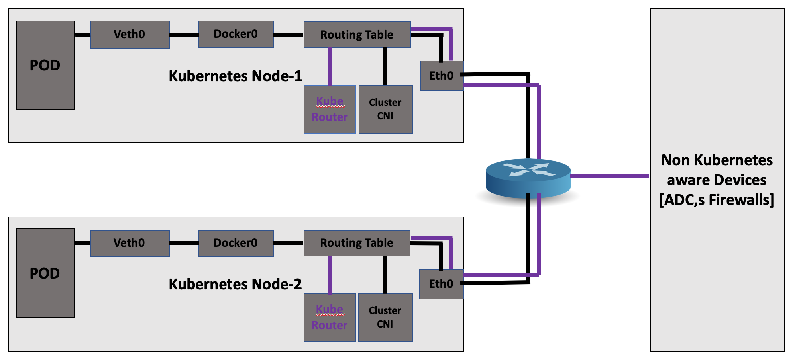

# kube-router
Chorus kube router is a solution to establish route between Kubernetes  cluster Nodes and non Kubernetes nodes.  This is use-full for ingress resource where  service IP's (Pod IP) can be configured on Ingress device for load balancing front end applications.  kube-router can be used for creating a route between Kubernetes and Ingress device.

---

# kube-router

kube-router is a micro service provided by Chorus that creates network between the Kubernetes cluster nodes and non kubernetes aware devices [F5, Citrix ADC]. 

## Contents

-  [Overview](#overview)
-  [Architecture](#architecture)
-  [How it works](#how-it-works)
-  [Get started](#get-started)
-  [Issues](#issues)
-  [Code of conduct](#code-of-conduct)
-  [License](#License)

## Overview

In Kubernetes environments, when you expose the services for external access through the ingress device, to route the traffic into the cluster, you need to appropriately configure the network between the Kubernetes nodes and the Ingress device. Configuring the network is challenging as the pods use private IP addresses based on the CNI framework. Without proper network configuration, the Ingress device cannot access these private IP addresses. Also, manually configuring the network to ensure such reachability is cumbersome in Kubernetes environments.

Chorus provides a microservice called as **kube-router** that you can use to create the network between the cluster and the Ingress devices.

## Architecture

The following diagram provides the high-level architecture of the kube-router:

kube-router creates a seperate network for any external devices and generate config-map file with network details. kube0router does the following 
- Manage seperate subnet for non kubernetes aware node
- Creates  vxlan overlays for the external non kubernetes aware nodes
- Genrate a config-map file which can be used for creating other endpoint overlays
## How it works

kube-router monitors the node events and establishes a route between the node to Citrix ADC using VXLAN. Citrix k8s node controller adds route on the Citrix ADC when a new node joins to the cluster. Similarly when a node leaves the cluster, Citrix k8s node controller removes the associated route from the Citrix ADC. Citrix k8s node controller uses VXLAN overlay between the Kubernetes cluster and Citrix ADC for service routing.

## Get started

Chorus kube-router can be used in the following two ways:

-  In cluster configuration. In this configuration, kube-router is run as **microservice**.
-  Out of the cluster configuration. In this configuration, the chorus is run as a **process**.

  
### Using kube-router as a process

Before you deploy the kube-router package, ensure that you have installed Go binary for running kube-router.

Perform the following:

1.  Download or clone the `kube-router` package.

2.  Navigate to the build directory 

3.   Start the `kube-router` using `make run`

### Using kube-router as a microservice

Refer the [deployment](deploy/README.md) page for running kube-router as a microservice inside the Kubernetes cluster.

## Issues

Use github issue template to report any bug. Describe the bug in details and capture the logs and share.

## Code of conduct

This project adheres to the [Kubernetes Community Code of Conduct](https://github.com/kubernetes/community/blob/master/code-of-conduct.md). By participating in this project you agree to abide by its terms.

## License

[Apache License 2.0](./license/LICENSE)
